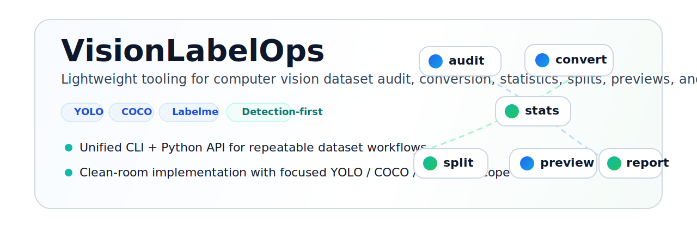
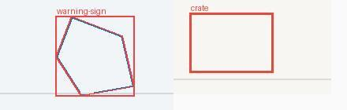
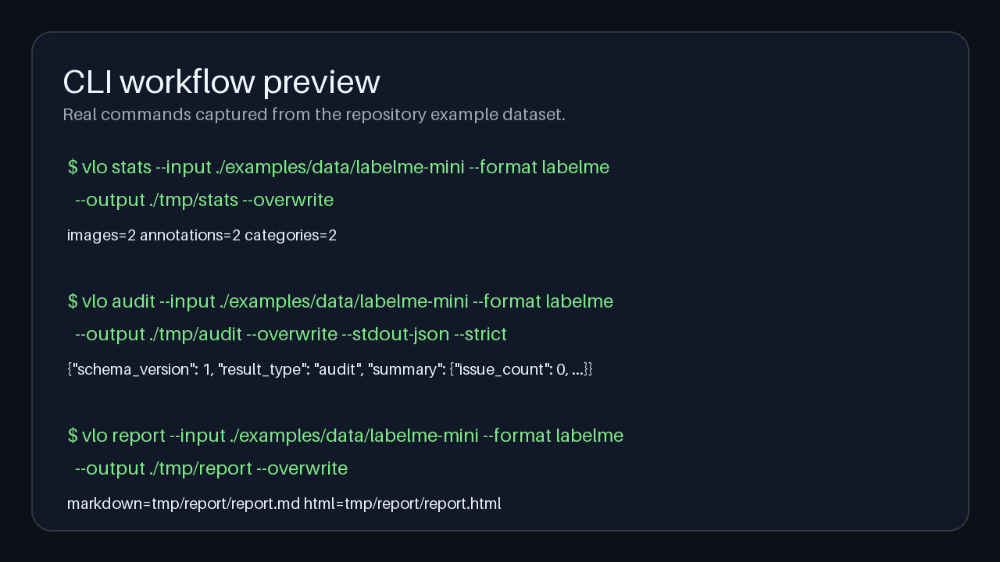

# VisionLabelOps

> 面向机器视觉数据集质检、转换、统计、划分、预览与报告生成的 detection-first 工具包。

[English](README.md) | **简体中文**

[](https://github.com/SakuraTearDuDu/VisionLabelOps/actions/workflows/ci.yml)
[](LICENSE)
[](https://www.python.org/downloads/)



VisionLabelOps 是一个轻量、可脚本化、可安装的 Python 项目，聚焦 YOLO、COCO 和 Labelme 场景下的数据集 `audit / convert / stats / split / preview / report` 工作流。它的目标不是替代大而全的数据平台、训练框架或标注 GUI，而是提供一套更清晰、更统一、更适合 GitHub 开源协作的工程化工具链。

## 项目亮点

- 🔎 **聚焦而克制**：围绕目标检测数据集工作流展开，不把能力面无限扩张。
- ⚙️ **统一 CLI + API**：同一套能力既能通过 `vlo` 命令行使用，也能嵌入 Python 脚本。
- 🧪 **适合自动化**：支持结构化结果文件、`--stdout-json`、CI 验证和内置演示数据。
- 🧼 **干净的开源边界**：clean-room 实现，参考来源与许可证边界清楚，仓库结构适合长期维护。

## 从这里开始

- 想最快上手：看 [快速开始](docs/quickstart.zh-CN.md)
- 想直接试命令：使用内置示例数据集 [`examples/data/labelme-mini`](examples/data/labelme-mini)
- 想先看效果：跳到 [结果预览](#结果预览)

## 一眼看懂支持范围

| 维度 | 当前 V1 支持 |
| --- | --- |
| 数据格式 | YOLO Detection、COCO Detection、Labelme JSON |
| 稳定转换路径 | Labelme -> YOLO、Labelme -> COCO、YOLO -> COCO、COCO -> YOLO |
| 核心工作流 | `audit`、`convert`、`stats`、`split`、`preview`、`report` |
| 使用方式 | Python API + `vlo` CLI |
| 演示数据 | `examples/data/labelme-mini` |

## 核心能力概览

| 命令 | 用来做什么 | 典型输出 |
| --- | --- | --- |
| `vlo audit` | 做数据集质量检查并输出风险摘要 | `result.json` |
| `vlo convert` | 在支持格式之间做 clean-room 转换 | 转换后的数据集 + `result.json` |
| `vlo stats` | 汇总图像、标注、类别和框分布统计 | `result.json` |
| `vlo split` | 生成可复现的 train / val / test 划分结果 | 划分后的数据集 + `result.json` |
| `vlo preview` | 导出叠加框/多边形的抽样预览图 | 标注预览图 + `contact_sheet.jpg` |
| `vlo report` | 生成 Markdown / HTML 报告 | `report.md`、`report.html`、`result.json` |

## 结果预览

以下图片都来自仓库内的真实示例产物，而不是占位图。

| 预览叠加结果 | CLI 与报告链路预览 |
| --- | --- |
|  |  |

如果你需要在 GitHub 仓库设置里配置 social preview，本仓库也准备了素材：[`docs/assets/social-preview.png`](docs/assets/social-preview.png)。

## 安装

### 从源码检出安装

Windows PowerShell：

```powershell
git clone https://github.com/SakuraTearDuDu/VisionLabelOps.git
cd VisionLabelOps
python -m venv .venv
.venv\Scripts\Activate.ps1
python -m pip install --upgrade pip
python -m pip install -e .[dev]
```

Linux/macOS bash 或 zsh：

```bash
git clone https://github.com/SakuraTearDuDu/VisionLabelOps.git
cd VisionLabelOps
python -m venv .venv
source .venv/bin/activate
python -m pip install --upgrade pip
python -m pip install -e .[dev]
```

### 最小运行时安装

```bash
python -m pip install .
```

## 快速开始

### 最小 CLI 路径

```bash
vlo stats --input ./examples/data/labelme-mini --format labelme --output ./tmp/stats --overwrite
vlo audit --input ./examples/data/labelme-mini --format labelme --output ./tmp/audit --overwrite
vlo preview --input ./examples/data/labelme-mini --format labelme --output ./tmp/preview --samples 2 --seed 7 --overwrite
```

### 适合脚本与流水线的模式

```bash
vlo audit \
  --input ./examples/data/labelme-mini \
  --format labelme \
  --output ./tmp/audit-json \
  --overwrite \
  --stdout-json \
  --strict
```

### 直接运行 API 示例

```bash
python examples/basic_api.py
```

更完整的中文上手路径见 [docs/quickstart.zh-CN.md](docs/quickstart.zh-CN.md)。

## Python API

```python
from pathlib import Path

from visionlabelops import audit_dataset, compute_stats, generate_report, read_dataset

dataset_root = Path("examples/data/labelme-mini")

dataset = read_dataset(dataset_root, "labelme")
stats = compute_stats(dataset_root, "labelme")
audit = audit_dataset(dataset_root, "labelme")
report = generate_report(
    input_path=dataset_root,
    input_format="labelme",
    output_path=Path("tmp/report"),
    audit_result=audit,
    overwrite=True,
)

print(dataset.image_count)
print(stats.annotation_count)
print(report.markdown_path)
```

## 范围边界

### 这个项目是什么

- 一套面向数据集质检、转换、统计、划分、预览和报告生成的工程化工具链。
- 一个 detection-first 的 YOLO / COCO / Labelme 工具包。
- 一个聚焦、可测试、可安装、适合 GitHub 开源协作的 clean-room 实现。

### 这个项目不是什么

- 不是 segmentation、keypoint、tracking 或训练框架项目。
- 不是桌面标注 GUI。
- 不是 Web 服务或云平台。
- 不是“什么格式都兼容”的大而全转换器。

### 当前已知限制

- Labelme 当前只支持 `rectangle` 和 `polygon`
- COCO 导入会跳过 `iscrowd=1`
- 当前 YOLO 读取逻辑刻意保持“窄而稳”，优先保证行为明确，而不是堆大量启发式兼容

## 为什么会有这个项目

这个方向已经有不少值得参考的开源项目，但它们优化的目标不同：

- Datumaro 更像广覆盖的数据集工程框架
- PyLabel 更偏轻量、低门槛的终端用户工具
- Supervision 在预览与可视化设计上提供了很多有价值的思路

VisionLabelOps 的定位则更偏中间路线：比大平台更轻，比零散脚本更统一，比 notebook-first 工作流更容易安装、复现和自动化。

## FAQ

### 这是 Datumaro、PyLabel、Labelme、JSON2YOLO 或 Ultralytics 的 fork 吗？

不是。VisionLabelOps 是一个独立代码库里的 clean-room 实现，项目结构、实现方式和文档体系都由本仓库自行维护。

### 这个项目支持 segmentation 或 keypoint 吗？

当前不把它们作为 V1 目标。项目在需要时可能保留部分 polygon 几何信息，但整体仍然是 detection-first 工具包。

### Windows 可以正常使用吗？

可以。当前文档、CLI 示例和 CI 都覆盖了 Windows，同时也补充了 Linux/macOS 的安装与使用示例。

## 开发说明

```bash
python -m venv .venv
python -m pip install -e .[dev]
pre-commit install
just verify
```

相关文档：

- [中文快速开始](docs/quickstart.zh-CN.md)
- [English Quick Start](docs/quickstart.md)
- [Architecture](docs/architecture.md)
- [Reference Notes](docs/reference_notes.md)
- [Release Checklist](docs/release_checklist.md)
- [GitHub Showcase Checklist](docs/github_showcase_checklist.md)

## 许可证与参考边界

VisionLabelOps 使用 [MIT License](LICENSE)。

参考项目仅用于架构、工作流、文件格式和行为研究，不代表复制其源码实现：

- Datumaro：模块化数据集操作与任务导向 CLI
- PyLabel：轻量转换与分析工作流体验
- Supervision：预览与可视化思路
- Labelme：JSON 字段与 shape 语义
- JSON2YOLO / Ultralytics：YOLO 转换行为预期

本项目不会复制 GPL / AGPL 仓库的源码、映射表或内部实现。
